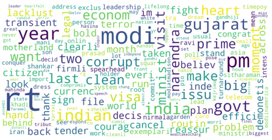

# Social Media Analytics

# Objective

To extract data from popular social media platforms and perform sentiment and statistical analysis on the same to obtain the overall public sentiment and temperament regarding a particular news or Phrase

# Tools

Web Scraping 
Sentiment Analysis 
Visualization

# Model 

We have trained a Bidirectional Long Short Term Memory (Bi-LSTM) model for sentiment analysis. 
We obtained an accuracy of 82% on the stanford sentiment140 dataset. 
We used softmax activation, Categorical Cross Entropy Loss and Adam Optimizer to train our model. 
We trained our model on 10 epochs with a batch size of 32. 
We have used SMOTE Algorithm to overcome class imbalance during the training process

# Applications

It is a major breakthrough for the Brand revitalization and Customer retention rate 
It is very useful in predicting the customer trends 
Hate speech detection 
Pre Poll trends during Elections 
Knowing the sentiment data of your competitors will give you a leading edge in the competition

## Results

Sentiment Analysis on Indian Prime Minister 'Mr.Narendra Modi'

      

